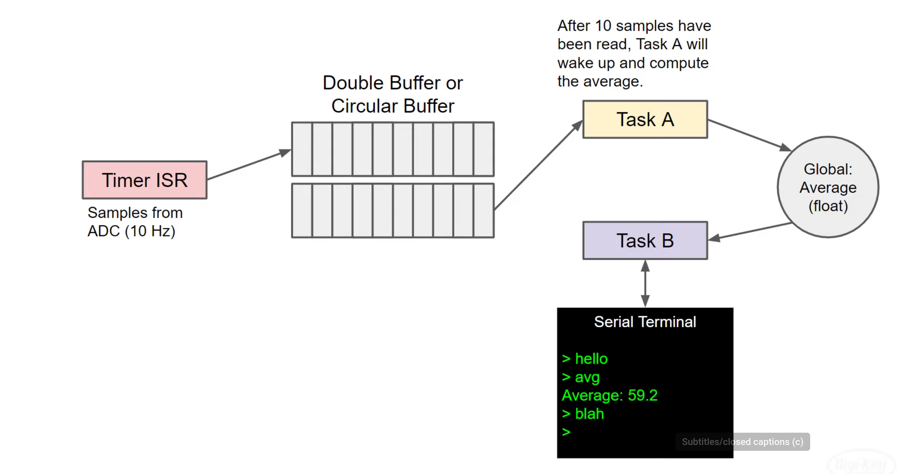

You are to create a HW timer that runs an ISR to sample from ADC 10 times per second. These values are to be placed in some kind of buffer. Once 10 samples have been collected over the course of 1 second, the ISR is to wake up task A, which then computes the average of those 10 samples.

Recommended: use a double/circular buffer so that data can be read from part of it while isr continues to fill up the other part.
The average should be a floating point value and it should be a stored in a global variable.
(Assume that this global point variable cannot be written to or read from in a single instruction cycle. - this assumption ignored)

Task B is to handle the terminal. It should echo back any character it sees. If you enter the command avg, it should print out the value found in the global variable. 



# notes on adc_continuous_read
adc_continuous_read is safe to use in ISR context for xTicksToWait set to 0.

adc_continuous_read uses xRingbufferReceiveUpTo under the hood, not  xRingbufferReceiveUpToFromISR.
However, the two main differences between the two ring buffer funcs are:
1. xRingbufferReceiveUpTo can have xTicksToWait != 0
2. xRingbufferReceiveUpToFromISR uses portENTER_CRITICAL_ISR spinlock (by calling prvReceiveGenericFromISR), while xRingbufferReceiveUpTo uses portENTER_CRITICAL (by calling prvReceiveGeneric).

However, according to this post: https://esp32.com/viewtopic.php?t=8427 portENTER_CRITICAL and portENTER_CRITICAL_ISR implementations are the same.

# bugs encountered
At some point, I encountered an issue where only the avg of queue2 got output to the console, following avg command, but not queue1.

At the time, my `adc_sampling_timer_cb` and `compute_avg_task` looked like the following
```
// fromISR
// return bool value is - Whether a high priority task has been waken up by this function
static bool adc_sampling_timer_cb(gptimer_handle_t timer, const gptimer_alarm_event_data_t *edata, void *user_ctx)
{
    timer_cb_data_t *cb_data = (timer_cb_data_t*) user_ctx;

    uint8_t result[ADC_READ_LEN] = { 0 };
    uint32_t out_length = 0;
    adc_continuous_read(adc_handle, result, ADC_READ_LEN, &out_length, 0);

    QueueHandle_t queue_cb = cb_data->queue_num == 1 ? queue1 : queue2;

    if (xQueueSendFromISR(queue_cb, &cb_data->num, NULL) != pdPASS) {
        cb_data->queue_num ^= 0x03;
        // notify compute_avg task - queue 1 is index 0, queue2 is index 1
        xTaskNotifyIndexedFromISR(x_compute_avg_task, cb_data->queue_num - 1, 0, eNoAction, NULL);
    }
    else
        cb_data->num++;

    return false;
}

// other code

static void compute_avg_task(void *arg)
{

    static uint32_t num = 0;
    int i = 0;
    while(1) {
        xTaskNotifyWaitIndexed(0,               // index 0
                               0x00,            // no need to clear notification value (not being used)
                               0x00,            // again, nothing to clear on exit (not used)
                               NULL,            // notification value is not needed, so set to NULL
                               portMAX_DELAY    // max time to wait in blocked state for notifcation
                              );
        avg = 0.0; i = 0;
        while (xQueueReceive(queue1, &num, 0) == pdPASS) {
            i++;
            avg += num;
        }
        avg /= i;
        ESP_LOGI(TAG, "avg of queue1 is %f", avg);

        xTaskNotifyWaitIndexed(1,               // index 1
                               0x00,            // no need to clear notification value (not being used)
                               0x00,            // again, nothing to clear on exit (not used)
                               NULL,            // notification value is not needed, so set to NULL
                               portMAX_DELAY    // max time to wait in blocked state for notifcation
                              );
        avg = 0.0; i = 0;
        while (xQueueReceive(queue2, &num, 0) == pdPASS) {
            i++;
            avg += num;
        }
        avg /= i;
        ESP_LOGI(TAG, "avg of queue2 is %f", avg);
    }

}

```

The reason behind the bug was the premature flip of the `cb_data->queue_num` in `adc_sampling_timer_cb`, which happened before signaling the compute_avg_task about the queue - so compute_avg_task got the wrong queue to process, and would get stuck until the receiving the notification for the queue that would unblock it.

So, this was what happened 
queue1 gets filled,
because of premature queue_num flip queue2 gets notification

compute_avg for queue1 waits

queue2 gets filled
because of premature queue_num flip queue1 gets notification

compute_avg queue1 executes
followed promptly by compute_avg queue2
because both queue1 and queue2 at this point have notifications, and so neither need to wait
hence avg of queue1 could not be printed


The fix was to move  `cb_data->queue_num ^= 0x03;` to be after task notify in timer callback function.
